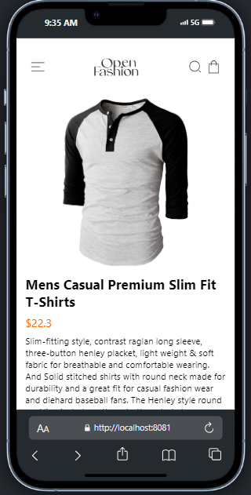
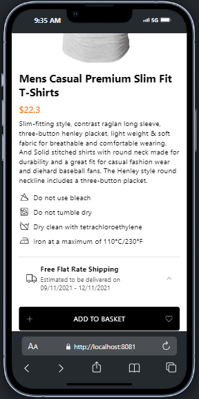

# Rn-assignment7-11125864

### Description of the OpenFashion App

## Design:
For this project, I have used a navigation structure based on the React Navigation Drawer Navigator. This allows me to have a sidebar with links to the different screens of the application, which makes navigation easier for the user. The main screens included are:

## HomeScreen: This is the main screen that displays a list of products.
## CartScreen: This screen shows the products the user has added to the cart.
## ProductDetailScreen: This screen displays the details of a specific product.

I have opted for this design because it is a common and familiar structure for mobile app users, which facilitates navigation and the user experience.

## Data Storage:

For data storage, I have used React Native's AsyncStorage. AsyncStorage is an API that allows you to store and retrieve key-value data asynchronously on the user's device. I have chosen this solution because it is a simple and efficient way to store and retrieve data in a mobile application, without the need for a remote database or a server-side API.

In my implementation, I use AsyncStorage to store the products added to the cart. Every time the user adds a product to the cart, I save it in AsyncStorage. When the user returns to the app, I retrieve the cart data stored and display it in the CartScreen.

# Screenshots:

Here are some screenshots of the OpenFashion application:

# Screenshots:

<table>
  <tr>
    <td></td>
    <td></td>
  </tr>
  <tr>
    <td></td>
    <td></td>
  </tr>
  <tr>
    <td></td>
    <td></td>
  </tr>
  <tr>
    <td></td>
    <td></td>
  </tr>
  <tr>
    <td></td>
    <td></td>
  </tr>
  <tr>
    <td></td>
    <td></td>
  </tr>
</table>
